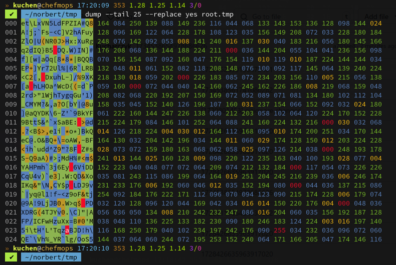
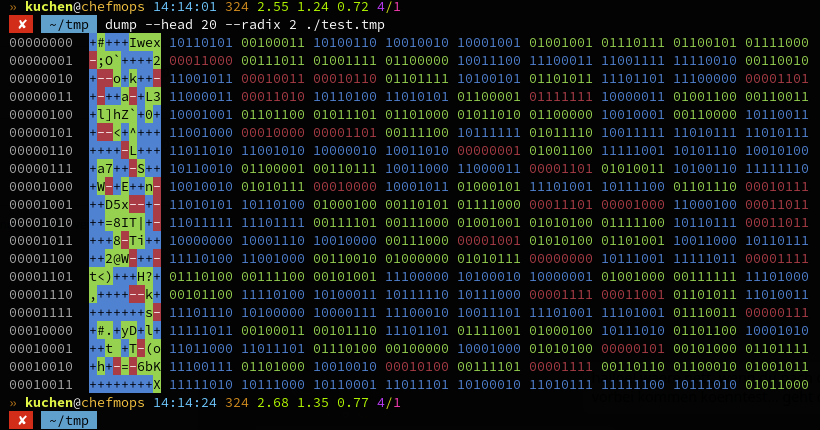
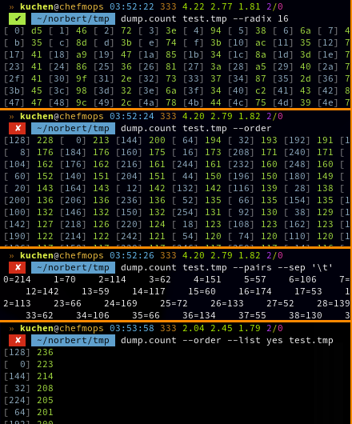
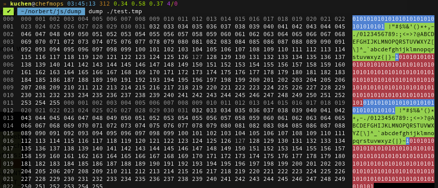
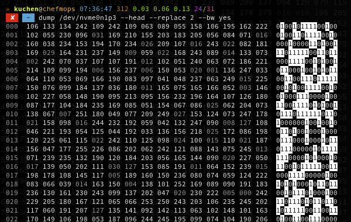
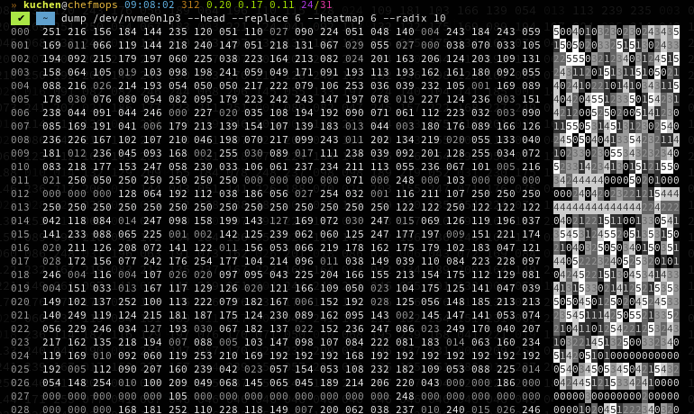

 

# The **`dump`** utility
My own **Radix viewer** (JavaScript version). First version only w/ **viewing** functionality..

> [!NOTE]
> When I talk about the **radix**, I mean the numeric **base** (decimal, binary/dual, ..).

  

## News
* \[**2025-06-19**\] New `--lines` [parameter](#command-line-parameters) **and** config item!
* \[**2025-06-11**\] New `--filter` parameter/configuration (to output without control characters);
* \[**2025-06-05**\] New [`util.js`](src/js/util.js): after **counting** printables, now I also can just print out only **printables**!
* \[**2025-04-02**\] Update: better [`util.js`](src/js/util.js); and now also w/ new [parameter](#command-line-parameters) `--summary`;
* \[**2025-03-24**\] Update: new **util**s `sum`. ... and a bit more, AFAIR.
* \[**2025-03-24**\] Newest update: the `dump` now also supports `--count` and `--count-sort`.

 

## Index
1. [Introduction](#introduction)
	* [First words](#first-words)
	* [Command Line Parameters](#command-line-parameters)
2. [Example Screenshots](#example-screenshots)
3. [Download](#download)
	* [Structure](#structure)
	* [Infra-Structure](#infra-structure)
		* [Contact me](#contact-me)
4. [Utilities](#utilities)
5. [Comments/F.A.Q.](#commentsfaq)
6. [Links](#links)
7. [Contact](#contact)
8. [Copyright and License](#copyright-and-license)

  

## Introduction
It became necessary since I wanted to inspect the changing data of my [Norbert](https://github.com/kekse1/norbert/).

 

### First words
It's more than a **Hex viewer**.. it's rather a **Radix viewer**; which will become a **Radix Editor** in some
time. I'm working on it just a little bit right now, since it's not the most important project for my purposes.
But it became necessary, so I invented it.

> [!TIP]
> JFYI: **Radix** is my word for a numeric **base**. The **decimal** system with base **10**,
> **hexadecimal** with **16**, or **binary** with **2**.
> So this project aim's to let you see input/file data in a specificly converted view.

I found out such a code like it's also the [**`hexyl`**](https://github.com/sharkdp/hexyl/) is really easy. Don't
know exactly how hard this will get when I will extend it (got a big TODO for this one). But it was a cake of piece
until now (even without looking at the hexyl source code).

 

### Command Line Parameters
The default 'runtime' parameters are not listed here. They got inserted by the startup
[shell scripts](src/sh/).

#### `dump`
Look at the [**`param.json`**](src/json/param.json):

* **`--refresh`** (Integer/Boolean)
* **`--radix`** (Radix)
* **`--path`** (File)
* **`--ansi`** (Boolean)
* **`--head`** (Boolean/Integer/String)
* **`--tail`** (Boolean/Integer/String)
* **`--start`** (Integer)
* **`--stop`** (Integer)
* **`--replace`** (Radix/Boolean)
* **`--heat`** (Integer)
* **`--color`** (String/null)
* **`--filter`** (Boolean)
* **`--modulo`** (Radix/Boolean)
* **`--follow`** (Boolean)
* **`--high`** (String/Integer)
* **`--without`** (String/Integer)
* **`--only`** (String/Integer)
* **`--count`** (String/Integer/Boolean)
* **`--count-sort`** (String)

#### `dump.util`
And here with the [**`param.util.json`**](src/json/param.util.json):

* **`--radix`** (Radix)
* **`--sort`** (Boolean/null)
* **`--offset`** (Integer)
* **`--size`** (Integer)
* **`--locale`** (Boolean)
* **`--ansi`** (Boolean)
* **`--pairs`** (Boolean)
* **`--sep`** (String)
* **`--list`** (Boolean)
* **`--spaces`** (Integer)
* **`--empty`** (Boolean)
* **`--high`** (String/Integer)
* **`--without`** (String/Integer)
* **`--only`** (String/Integer)
* **`--printable`** (Boolean)
* **`--silent`** (Boolean)
* **`--summary`** (Boolean)
* **`--above`** (Boolean)
* **`--filter`** (Boolean)
* **`--lines`** (Integer/null)

#### Boolean
The Boolean values are either without any value assignment, which sometimes causes problems when the
command line continues with non-key-parameters, then these would be assigned to the keys. Or they can
be written out (which is my recommendation) as follows: [ **`yes`**, **`no`**, **`on`**, **`off`** ];

#### Special Syntax
There are (very less) parse functions to interprete your parameters.

Mostly it's the color string parser, which interpretes RGB input colors (separated by `,` or `;` (optionally)).
And for the `--without` or `--only` you can also define more than one byte, separated via `,`, and even byte
ranges via `-`. The (optional) last `+` separator to define the step. The last (also optional) parameter is
the input value radix/base, which will be used to interprete your input numbers; it's separated by a regular
slash `/`.

So e.g., when you want to show only even/odd numbers, e.g. try `--without/--only '0-255+2'`. Another example
can be `--high '0-ff+f/16'` (so mask all bytes between the hexadecimal values `0` to `ff`, with a step of
the hexadecimal `f` (so all 15 bytes).

The colors can be defined via three bytes separated by comma `,`; more colors separated via `;` as whole,
or more comma `,`. It doesn't really matter, but please do not combine both in one parameter.

#### `--head` and `--tail`
If defined empty (or with `yes/no/on/off`), size will automatically be adapted to your console's height.

It can also be an integer for the target line count; or a string with a '%' suffix, so you can define
a percentage of your console's height.

  

## Example Screenshots

> [!TIP]
> With the newest version I also added the check for many null `\0`. Any empty line would so be summed up,
> to see only one line with the info how much lines and bytes (with size) were ignored.
> **Update**: looking for **same** bytes, not only the null.

This is a newer preview screenshot. Updated design, styles/colors, parameters, and more.

Here's a newer dump/utility, one to count any bytes in a file (for possible parameters see the
[`param.util.json`](src/json/param.util.json), and the [`config.util.json`](src/json/config.util.json) maybe).

> [!NOTE]
> If you've other ideas for possible `dump` **utilities**, please mail me.

And this is showing the `--replace` feature.
at least 

> [!WARNING]
> The following screenshots are a bit older, so neither the command line
> parameters are updated there, nor the colors/design. JFYI.

And this is a newer one, with less extensions and a newly configured [configuration](./src/json/config.json),
mostly with better colorization, plus the feature to not insist on a simple replacement character for
non-printable or ANSI characters, but to draw a radix converted view on it - whereas I'd like to use
the `2` to let the user see if the byte is even or odd. ;-)

My latest feature: I wanted to analyse some abstract complexity in my A.I. header data by looking at it in binary,
by doing a modulo operation. To directly see the structure or any abnormality or similarity or smth. like it, the
last thing was to colorize the bits (other bases also possible..). That's the result (and I really figured my
problem out) (and btw, superseded by the `--heat`, below):

Extended the latest feature to see kinda **heatmap**; this way I really saw how much my values are distributed
over the header data.

  

## Download
You can download it by browsing the [**`./src/`**](./src/). It's a [`Node.js`](https://nodejs.org/) **sub** project.

 

### Structure
* [**`js/`**](./src/js/): the 'real' code; one **startup** script [`main.js`](src/js/main.js) (for [`dump.sh`](src/sh/dump.sh)), the [`dump.js`](src/js/dump.js), [`util.js`](src/js/util.js) and the [`helper.js`](src/js/helper.js);
* [**`json/`**](./src/json/): two configuration files (`config*.json`) and two schemes for the possible argv parameters (`param*.json`);
* [**`sh/`**](./src/sh/): **startup** (bash) shell scripts; in general I'm massively using such helper scripts (enivironment preparations);

I **think** in the future I'll also provide an easy setup/install script. But not for now. We'll see..

> [!TIP]
> At the moment I prefer to use the newest [`dump.printable.sh`](./src/sh/dump.printable.sh) (which
> is actually just a wrapper around the `dump.count` utility) with my preferred settings (TODO?).

Additionally, my [configuration `.json` file](./src/json/config.json) will have a better structure. It all was quick-and-easy setup for me,
but the more config parameters will come, the more structure they need .. and gonna have.

> [!NOTE]
> I'm using my `.json` configuration with the help of my
> [**`config.js`**](https://github.com/kekse1/javascripts/#configjs).

> [!NOTE]
> I'm also using my own [**`JSON.js`**](https://github.com/kekse1/json.js/) project in here.
> This is why you can see the comments in my [`config.json`](./src/json/config.json).

 

### Infra-Structure
> [!IMPORTANT]
> This project relies on my own JavaScript infrastructure.

So you can only see the code of this **sub** project. It doesn't really run stand-alone.

If you'd like to use it, you could bring in your own **polyfill**. .. in case you don't
want to wait until I'm going to run my
[**`init-sub-proj.sh`**](https://github.com/kekse1/scripts/?tab=readme-ov-file#init-sub-projsh).

  

## Utilities
I also needed some helping utilities for my purposes, so I started here.

Use the [**`dump.util.sh`**](src/sh/dump.util.sh) for an overview, and also to directly call the
utilities which are shown in this script. But there are also [shell scripts](src/sh) for each
available one.

These are the only available utilties (**atm**):
* [**`count`**](src/sh/dump.count.sh)
* [**`sum`**](src/sh/dump.sum.sh)
* [**`rot13`**](src/sh/dump.rot13.sh)
* [**`print`**](src/sh/dump.print.sh)

They all require at least a file path [parameter](#command-line-parameters) and can also
make us of all the [available parameters](#command-line-parameters).

> [!TIP]
> The **`rot13`** utility expects a single integer value (without any key) for the value
> to add/sub to any input byte. With**out** this parameter it automatically uses the
> **`13`** (see [**Rot13**](https://wikipedia.org/wiki/ROT13)).

> [!NOTE]
> All the **utils** all supports some general parameters/arguments. The most important
> should be `--only` and `--without`. For the rest see the [command line parameters](#command-line-parameters).

  

## Comments/F.A.Q.

### Question: Why do we use `++this.linesPrint`/etc. in the code?
I'm massively using [`tmux`](https://github.com/tmux/tmux/),
and this doesn't seem to support cursor load (`\e[u`) nor save (`\e[s`)! **:-/**

#### Contact me
If you think this project could be beneficial to you, or if you're simply interested in trying it out,
please send me a [**mail**](#contact) expressing your interest, or create an [**issue**](#contact)
here on GitHub.

Once we have enough requests, I'll make the effort to get everything up and running for you all.

  

## Links
* [`hexyl`](https://github.com/sharkdp/hexyl/)

I mention this project here because I often used it before I came up with my own solution.

In the future, when I'm extending this code base, I think I'm going to see this foreign
project as an example for me. Like more colors for different types of byte data, and more.

 

# Contact

# Copyright and License
The Copyright is [(c) Sebastian Kucharczyk](./COPYRIGHT.txt),
and it's licensed under the [MIT](./LICENSE.txt) (also known as 'X' or 'X11' license).

